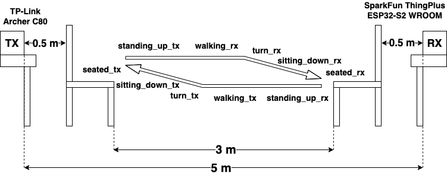
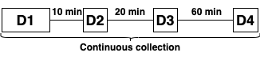

# Collected dataset descriptor

This document describes the collected dataset along with the data collection characteristics. The dataset consists of WiFi CSI data collected while a person executed some activities in several locations at certain time.

## Data collection setup

The data collection setup is summarized in the following figure:

In the following subsections, the main characteristics of the setup (devices, environment and activities) are described.

### Devices

Two devices were used, one acting as a transmitter (TX) and one as a receiver (RX): 

- TP-Link Archer C80 (TX): access point of a 2.4GHz WiFi network (IEEE 802.11n) on channel 6.
- SparkFun ThingPlus ESP32-S2 WROOM (RX): microcontroller running the [Espressif's code](https://github.com/espressif/esp-csi/tree/master/examples/get-started/csi_recv_router) for WiFi CSI extraction, configured to obtain the CSI data of the high throughput long training field (HT-LTF) subcarriers. The device connects to the TX and pings it every 20ms (100Hz), extracting the WiFi CSI data from the ping replies. Therefore, WiFi CSI data was approximately colleted at 100Hz.

### Environment

- The devices are separated by 5 meters.
- A chair is placed at 0.5 meters from each device. Both chairs are separated by 3 meters. 

### Activities

The user moved from one chair to another repeated times, executing a sequence of activities. These activities are the following:

- First sequence (from RX to TX):
  - _seated_rx_: the user is _seated_ in the chair close to RX.
  - _standing_up_rx_: the user is _standing up_ from the chair close to RX.
  - _walking_tx_: the user is _walking_ from the chair in RX to the chair in TX.
  - _turn_tx_: the user is _turning_ while approaching the chair close to TX.
  - _sitting_down_tx_: the user is _sitting down_ in the chair close to TX.
  - _seated_tx_: the user is _seated_ in the chair close to TX.

- Second sequence (from TX to RX):
  - _seated_tx_: the user is _seated_ in the chair close to TX.
  - _standing_up_tx_: the user is _standing up_ from the chair close to TX.
  - _walking_rx_: the user is _walking_ from the chair in RX to the chair in RX.
  - _turn_rx_: the user is _turning_ while approaching the chair close to RX.
  - _sitting_down_rx_: the user is _sitting down_ in the chair close to RX.
  - _seated_rx_: the user is _seated_ in the chair close to RX.

## Data collection procedure

The data collection was executed as following:

- First, the user executed the described sequences of activities 10 times, with a total of 20 sequences executed. This part of the dataset is named _D1_.
- Then, after 10 minutes, the user executed again 4 sequences of activities (2 in each direction). This part of the dataset is named _D2_.
- Next, after 20 minutes, the user executed again 4 sequences of activities (2 in each direction). This part of the dataset is named _D3_.
- Finally, after 60 minutes, the user executed again 4 sequences of activities (2 in each direction). This part of the dataset is named _D4_.

During the whole procedure, the RX was continuosly collecting WiFi CSI data, thus containing data related to the execution of certain activities (_D1_, _D2_, _D3_ and _D4_) or the absence of movement (remaining data).

The described data collection procedure is depicted in the following figure:

## Files

### Raw files

The dataset raw related files are stored in the [`./01_RAW`]('./01_RAW') directory. These files are the following ones:

- [`dataset.csv`]('./01_RAW/01_dataset.csv'): contains the full colleted dataset. The meaning of each column can be consulted [here](https://docs.espressif.com/projects/esp-idf/en/release-v4.4/esp32/api-reference/network/esp_wifi.html#_CPPv418wifi_pkt_rx_ctrl_t). An additional column named `pc_timestamp` was added on collection time containing the current NTP synced timestamp.
- [`02_segments-DX.csv`]('./01_RAW/02_segments-Dx.csv'): contains the time when a change of activity occured in _DX_. The columns are the following:
  - execution: determines the execution id. It has the following pattern: e{XX}\_{rx_tx|tx_rx}, where:
    - XX: number of the execution.
    - rx_tx|tx_rx: direction of the execution. For instance, in rx_tx the execution goes from the chair close to the RX to the chair close to the TX.
  - phase: determines which activity starts or ends. These are the possible phases:
    - start: the execution starts. The _seated\_{r|t}x_ starts.
    - standing_start: the _seated\_{r|t}x_ ends and _standing\_up\_{r|t}x_ starts.
    - standing_end: the _standing\_up\_{r|t}x_ ends and _walking\_{r|t}x_ starts.
    - turn_start: the _walking\_{r|t}x_ ends and _turn\_{r|t}x_ starts.
    - turn_end: the _turn\_{r|t}x_ ends and _sitting\_down\_{r|t}x_ starts.
    - sitting_end: the _sitting\_down\_{r|t}x_ ends and _seated\_{r|t}x_ starts.
    - end: the execution ends. The _seated\_{r|t}x_ ends.
  - year
  - month
  - day
  - hour
  - minute
  - second
  - ms
  
The code to load the dataset, the segmentation information and to add the labels to the datasets can be found in the `02_collected-data-processing.ipynb` notebook.

### Labelled files

The directory [`02_LABELLED`](./02_LABELLED) contains a subdirectory for each dataset with the executions splitted and labelled in `npy` (NumPy format) files (output from the `02_collected-data-processing.ipynb` notebook). Each file follows the pattern e{XX}\_{rx_tx|tx_rx}-{x|y}.npy, where:

- XX: execution id.
- rx_tx|tx_rx: direction of the execution.
- x|y: type of data contained in the file:
  - x: signal amplitudes (not raw CSI) extracted from the WiFi CSI data.
  - y: activity labels of each sample in x.
  
  
## License

This dataset is made available under the [Open Data Commons Attribution License](http://opendatacommons.org/licenses/by/1.0/).